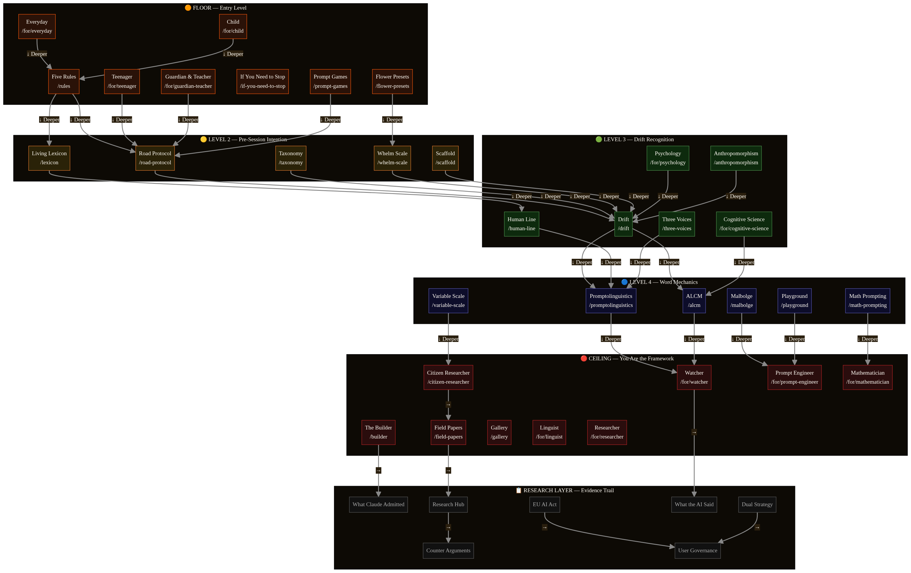
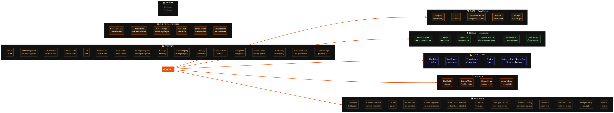

# MASTER PLAN — GallantryAI
*Written April 19, 2026. Every word from Matthew's direction and the session documents.*
*Read this at the start of every session. Do not start work without reading this.*

---

## WHAT MATTHEW WANTS

Two things. Both promised. Neither fully delivered.

**1. The whole site editable — inline, on his phone, tap and change.**
Every heading. Every paragraph. Every card. Every image. Tap it. Orange glow. Editor opens. Change it. Save it. No code. No admin panel. Just tap.

**2. The site map overlay — interactive diagram in the top nav.**
Two views. Scaffold view (levels Floor to Ceiling). Radial view (Home at centre, six branches). Every node clickable. Navigates to that page. Grows as the site grows.

---

## WHAT IS ACTUALLY BUILT RIGHT NOW

### The inline editor — partially built

The infrastructure exists:
- `content_blocks` table in the database — with `status`, `draftContent`, `previousContent` columns
- Server procedures: `saveDraft`, `publishBlock`, `publishAllDrafts`, `undoLastEdit`, `getDraftBlocks`, `getPublishedBlocks`
- `InlineBlockEditor` component — bottom sheet on phone, right panel on desktop. Sections: Text, Media, Link Manager, Background, Buttons, Block, Preview mode
- `StudioBlocks` component — renders blocks from the database with orange glow when admin is logged in
- `PageStudioBlocks` — mounted in `Footer.tsx` on every page, maps URL to page slug, renders `StudioBlocks`
- Orange glow — now always visible on mobile when logged in as admin (fixed tonight)
- Tap+hold on mobile opens the editor
- Live/Draft lens toggle in Studio
- Page Overview with snapdom thumbnails

### What is NOT built

**The page content is still hardcoded in React files.**

Every heading, paragraph, card, and section on every page is written directly in `.tsx` files. It is not in the database. It cannot be tapped and edited.

The `StudioBlocks` component only renders blocks that were manually added through Studio. It does not wrap the existing page content.

**This is the gap.** The whole site content migration — moving every page's content from hardcoded React into database blocks — was planned, researched, and confirmed. It was not executed.

---

## THE CONTENT MIGRATION — HOW IT WORKS

### The approach (confirmed in session April 18, 2026)

**Additive. Never destructive.**

The original `.tsx` files stay intact. The page content is extracted into database blocks. The page then renders from the database. If the database is empty, the page falls back to the hardcoded content. No blank pages possible.

### The two types of pages

**Type 1 — Data array pages (42 pages)**
These pages have their content in JavaScript arrays or objects at the top of the file. Examples: `FiveRules.tsx` has a `rules` array. `LivingLexicon.tsx` has a `lexiconData` array.

Migration: write a seed script that reads the arrays and inserts each item as a database block. Then update the page to read from the database instead of the array.

**Type 2 — Inline JSX pages (21 pages)**
These pages have content written directly in JSX — headings, paragraphs, cards written as HTML tags. Examples: `Builder.tsx`, `RoadProtocol.tsx`.

Migration: manually define each section as a block, insert into the database, then wrap each section in `AdminBlockWrapper` so it glows and is tappable.

### The page list — all 61 pages

```
AlcmPage.tsx
Anthropomorphism.tsx
Articles.tsx
Backstage.tsx
BarneyPoem.tsx
Builder.tsx
BuilderOrigin.tsx
BuildersKids.tsx
ChildFiveRules.tsx
ChildPatterns.tsx
ChildPrompts.tsx
CitizenResearcher.tsx
CounterArguments.tsx
Drift.tsx
DualStrategy.tsx
EuAiAct.tsx
FieldPapers.tsx
FieldReportReview.tsx
FiveRules.tsx
FlowerPresets.tsx
Frameworks.tsx
GallantryAiPage.tsx
Gallery.tsx
Hallucinations.tsx
Home.tsx
HumanLine.tsx
KidsLearn.tsx
LivingLexicon.tsx
Malbolge.tsx
MathPrompting.tsx
OpenDoor.tsx
Playground.tsx
PromptGames.tsx
PromptLibrary.tsx
Promptolinguistics.tsx
ResearchHub.tsx
RoadProtocol.tsx
SafetyPage.tsx
Scaffold.tsx
SchoolBoard.tsx
ScreenshotSharing.tsx
Taxonomy.tsx
ThreeLenses.tsx
UserGovernance.tsx
VariableScale.tsx
WhatClaudeAdmitted.tsx
WhatTheAiSaid.tsx
WhelmScale.tsx
lenses/ChildLens.tsx
lenses/CognitiveScienceLens.tsx
lenses/EverydayLens.tsx
lenses/GuardianTeacherLens.tsx
lenses/LinguistLens.tsx
lenses/MathematicianLens.tsx
lenses/PromptEngineerLens.tsx
lenses/PsychologyLens.tsx
lenses/ResearcherLens.tsx
lenses/TeenagerLens.tsx
lenses/WatcherLens.tsx
```

---

## THE CONTENT MIGRATION — BUILD ORDER

### Phase 1 — Five Rules (proof of concept)

Do this page first. Show Matthew it works. Then continue.

`FiveRules.tsx` has a `rules` array with 5 rules. Each rule has: title, body, icon, colour.

Steps:
1. Write seed script — insert each rule as a block in the database with `pageSlug: "rules"`
2. Update `FiveRules.tsx` — fetch blocks from database, render each rule from the block data
3. Wrap each rule card in `AdminBlockWrapper` — orange glow, tap+hold opens editor
4. Test in browser — log in as admin, go to /rules, tap a rule card, change the text, save

### Phase 2 — All data array pages (batch)

These pages have arrays that can be scripted. Run one seed script per page. Then update each page to read from the database.

Priority order (most visited first):
1. `RoadProtocol.tsx`
2. `LivingLexicon.tsx` (already partially DB-driven)
3. `Promptolinguistics.tsx`
4. `FlowerPresets.tsx`
5. `PromptGames.tsx` (already partially DB-driven)
6. `Taxonomy.tsx`
7. `Scaffold.tsx`
8. `Frameworks.tsx`
9. `Malbolge.tsx`
10. `AlcmPage.tsx`
11. All lens pages (10 pages — same structure, batch them)
12. All children's pages (6 pages)
13. Remaining pages

### Phase 3 — Inline JSX pages (manual)

These need manual block definition. Do them one at a time.

1. `Builder.tsx`
2. `BuilderOrigin.tsx`
3. `Home.tsx`
4. `FieldPapers.tsx`
5. `CitizenResearcher.tsx`
6. `HumanLine.tsx`
7. `Drift.tsx`
8. Remaining pages

---

## THE SITE MAP OVERLAY — WHAT WAS PROMISED

### The two diagrams

Both diagrams are saved at:
```
/home/ubuntu/gallantryai/docs/diagrams/sitemap-scaffold-levels.png
/home/ubuntu/gallantryai/docs/diagrams/sitemap-radial-home.png
```

**READ THESE FILES BEFORE PLANNING THIS FEATURE. Every session.**

**Diagram 1 — Scaffold Levels:**



**Diagram 2 — Radial from Home:**



### Diagram 1 — Scaffold Levels

Five levels stacked top to bottom. Every page is a node. "↓ Deeper" arrows connect levels.

| Level | Colour | Pages |
|---|---|---|
| FLOOR — Entry Level | Orange | Everyday, Child → Five Rules, Teenager, Guardian & Teacher, If You Need to Stop, Prompt Games, Flower Presets |
| LEVEL 2 — Pre-Session Intention | Yellow | Living Lexicon, Road Protocol, Taxonomy, Whelm Scale, Scaffold |
| LEVEL 3 — Drift Recognition | Green | Psychology, Anthropomorphism, Human Line, Drift, Three Voices, Cognitive Science |
| LEVEL 4 — Word Mechanics | Blue | Variable Scale, Promptolinguistics, ALCM, Malbolge, Playground, Math Prompting |
| CEILING — You Are the Framework | Red | Citizen Researcher, Watcher, Prompt Engineer, Mathematician, The Builder, Field Papers, Gallery, Linguist, Researcher |
| RESEARCH LAYER — Evidence Trail | Grey | What Claude Admitted, Research Hub, EU AI Act, What the AI Said, Dual Strategy, Counter Arguments, User Governance |

### Diagram 2 — Radial from Home

Home at the centre. Six branches radiating outward.

| Branch | Colour | Pages |
|---|---|---|
| CONCEPTS | Amber | ALCM, Promptolinguistics, Variable Scale, Whelm Scale, Drift, Human Line, Three Voices, Anthropomorphism, Malbolge, Math Prompting, Taxonomy, Living Lexicon, Playground, Prompt Games, Dual Strategy, User Governance, GallantryAI Faq |
| CHILDREN'S CLUSTER | Orange-red | Child Five Rules, Child Patterns, Child Prompts, Kids Learn, School Board, Hallucinations |
| HATS — Entry Modes | Dark red | Everyday, Child, Guardian & Teacher, Watcher, Teenager |
| LENSES — Professional | Dark green | Prompt Engineer, Linguist, Researcher, Cognitive Science, Mathematician, Psychology |
| FOUNDATION | Dark blue | Five Rules, Road Protocol, Flower Presets, Scaffold, Safety |
| BUILDER | Dark maroon | The Builder, Builder Origin, Barney Poem, Builder's Kits |
| RESEARCH | Dark grey | Field Papers, Citizen Researcher, Gallery, Research Hub, Counter Arguments, What Claude Admitted, EU AI Act, Field Report Review, Screenshot Sharing, Open Docs, What the AI Said, Prompt Library, Articles |

### What the feature is

Interactive diagram in the **top nav** — triggered by a button. Visitor clicks it, sees the full site structure. Every node clickable, navigates to that page.

Two views, one toggle:
- Scaffold view (Diagram 1)
- Radial view (Diagram 2)

Nodes coloured by level/cluster. In Studio, nodes show draft/publish status.

### Build plan — Site Map Overlay

**Step 0:** Five browser-only checks first. Fix anything broken before building.

**Step 1:** Data layer — `getSiteMapData` procedure. Returns all pages with level, cluster, URL, draft status.

**Step 2:** Scaffold view component — vertical levels, coloured nodes, arrows, clickable.

**Step 3:** Radial view component — Home at centre, six branches, coloured clusters, clickable.

**Step 4:** Toggle between views. Nav trigger. Overlay or dedicated page.

**Step 5:** Studio integration — nodes show draft/publish status.

**Step 6:** TypeScript check, tests, checkpoint.

---

## OTHER OPEN ITEMS (from session documents)

These were promised and not yet done:

1. **UI Polish** — buttons, shadows, premium feel, site-wide. Start with homepage and Nav. Talk before build.
2. **Professional landing page** — `/for/professional` — all 6 professional lenses as styled tiles. Overdue since April 17.
3. **Ghost code audit** — every page needs governance header checked.
4. **Playground Interactive Build** — 5 questions must be answered by Matthew before any build starts. HARD STOP.
5. **Builder's Log + What the AI Said** — no version bump tonight. Next content session.

---

## FIVE BROWSER-ONLY CHECKS (run before every new build)

These were identified April 19 and never verified:

1. Thumbnails appear in Overview (Studio → any page → Overview tab)
2. Photo upload reaches S3 (Studio → Media tab → upload small image)
3. Orange glow on blocks (go to `/rules`, log in as admin, tap a block)
4. Publish All goes live (edit block → save draft → publish all → switch to Live lens)
5. Undo restores (after publishing, tap Undo — old content comes back)

---

## GOVERNANCE RULES (non-negotiable)

1. Talk before build. Always. No exceptions.
2. Matthew is always in charge. The AI helps. The user decides.
3. Ghost code on every file touched.
4. Nav is DB-driven. Studio Nav & Footer tab is the edit path. navData.ts is fallback only.
5. SESSION-HANDOFF.md is append-only. Never remove content.
6. Builder's log + What the AI Said + SESSION-HANDOFF append + SESSION-CURRENT rewrite + checkpoint = one close-out action.
7. 6-point page standard is a hard quality gate. Check every public page touched.
8. Do not touch auth logic without briefing Matthew first.
9. MATTHEW-THOUGHTS.md is read-only.
10. Do not say done until Matthew has seen it in the browser and confirmed it.
11. Mobile-first. Matthew works from phone and desktop.
12. CMCI: any document referencing Christian St. Louis's work must be discussed with him before publishing.

---

*Written April 19, 2026. From Matthew's words and the session documents. Nothing added.*
